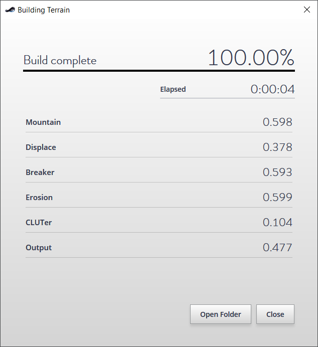
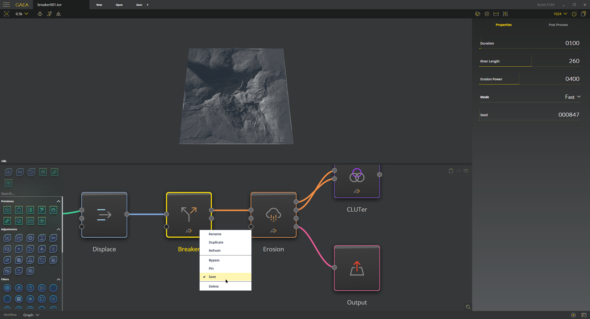
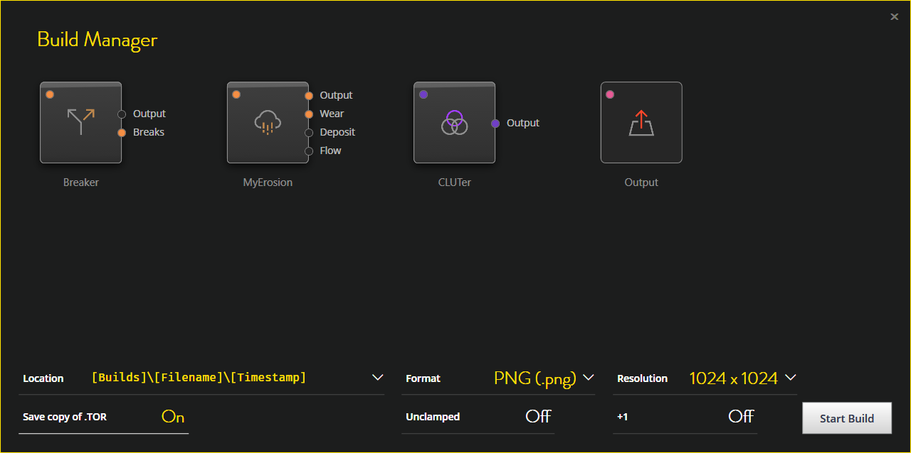
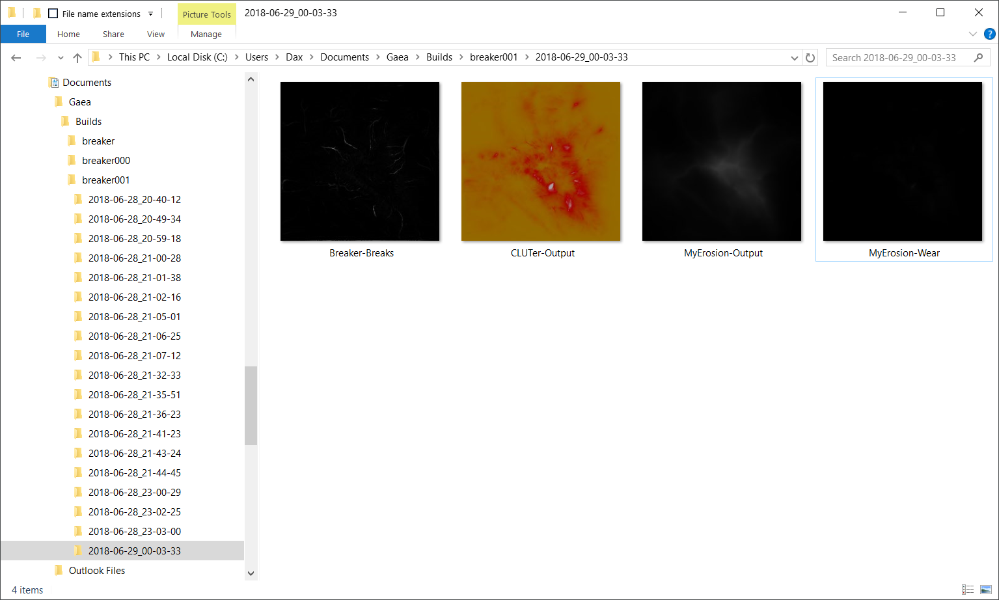

### Table of Contents
- [Building Terrains](#building-terrains)
- [Mark for Save](#mark-for-save)
- [The Build Manager](#the-build-manager)
- [Version Control and Organization](#version-control-and-organization)
    - [Organizing Builds](#organizing-builds)
    - [Example paths](#example-paths)
    - [Version Controlling Terrains](#version-controlling-terrains)

## Building Terrains

The output from your Graph must be saved to a file in order to use it elsewhere. To do this, you must build the output. When you build the output, Gaea will create it at your target resolution. This may take a while to build depending on the complexity of your graph, and the effects used.



Over the course of a complex project, saving and managing the appropriate outputs becomes a tedious ordeal. Managing outputs for many different nodes, especially those with multiple outputs such as the Erosion node, makes it even worse.

The Build Manager simplifies how builds are saved, organized, and managed for future use.

## Mark for Save
Instead of creating a dedicated “Output” node and then specifying the file to save, you can mark a node for automatic output. Just right-click any node and select “Save”.



Instead of creating a dedicated “Output” node and then specifying the file to save, you can mark a node for automatic output. Just right-click any node and select “Save”.

## The Build Manager
Now when you click Build, instead of firing off a build directly, you will see the Build Manager. The Build Manager gives you easy access to crucial output preferences.



The node grid shows you all the nodes marked for output. You can temporarily toggle a node by clicking the color circle in the top left corner of the node. This does not affect the build, only the output. This can be useful when you only want to see a few specific outputs, or need to go back to rebuild an older project for selective output.

When a node has multiple outputs, such as the Erosion or Breaker nodes in this example, you can individually toggle which ports should be saved as files.

You can choose the file format to use for all outputs, modify a node's output name by clicking on the node's label, choose unclamped (formerly called “Full Range”), and +1 output(where 512 x 512 becomes 513 x 513 — necessary for some game engines).

You can also use the Build Manager for version control and file organization.

## Version Control and Organization

### Organizing Builds
The Location field in the Build Manager provides two built-in options for storing your builds.

The first option is the central build repository, which is stored in My Documents\Gaea\Builds\[Filename] by default, but can be changed to any location — even on a local network or an online shared folder with OneDrive, Dropbox, GDrive, etc. This can be useful in team situations.



The other option is to have it stored alongside the file in a Builds folder. So if your file is called MyTerrain.tor, a folder called MyTerrain_Builds will be placed next to it.

In both cases, inside the Builds folder, a subfolder with the build timestamp is created. The build output files, a build.info file, and the .tor copy are stored inside this subfolder.

### Example paths
Central Repository:
`C:\Users\Username\Documents\Gaea\Builds\EastRiver\2018–06–22_22–55–31\`

Local File:
`D:\Work\Terrains\EastRiver_Builds\2018–06–22_21–55–31\`

But these are not the only options. You can explicitly specify a location instead of choosing a template, or create your own combinations using an absolute path and variables such as:
* `[FileLocation]` Location of the currently open file.
* `[Builds]` Central build repository.
* `[Filename]` Name of the current file without extension.
* `[Resolution]` Current resolution (eg. 8192).
* `[Timestamp]` Sortable timestamp in YYYY-MM-DD_HH-MM-SS format.
* `[Username]` Your local network identity.
* `[Machine]` Your local network machine name.

So you could create your own path template such as:
```[Builds]\[Filename]\[Timestamp]\[Resolution]\``` — which would create ```~\Documents\Gaea\Builds\EastRiver\2018–06–22_21–55–31\8192\```

or something more specific such as:

```\\00.00.00.00\Team\Terrains\[Username]_[Timestamp]\ ```
 which would create ```\\00.00.00\Team\Terrains\Bob_2018–06–22–55–31\```

### Version Controlling Terrains
Gaea's Build Manager and Build Stack give you low level version control without additional overhead.

The “Save copy of .TOR” option is useful when you want to manage different versions of your actual project file. When turned on, every time your build finishes, a copy of the .tor file in the exact state of that particular build is stored alongside the build output. You can easily go back to any older build state for your file, save it as new file.

You can also map the folder to almost any modern version control system (Git, Mercurial, Visual Studio Team Services, etc.), or share on a network folder with your team.