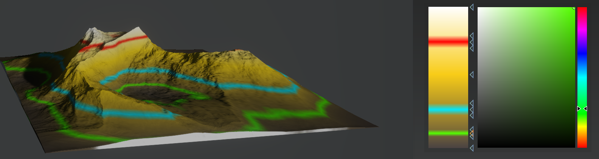
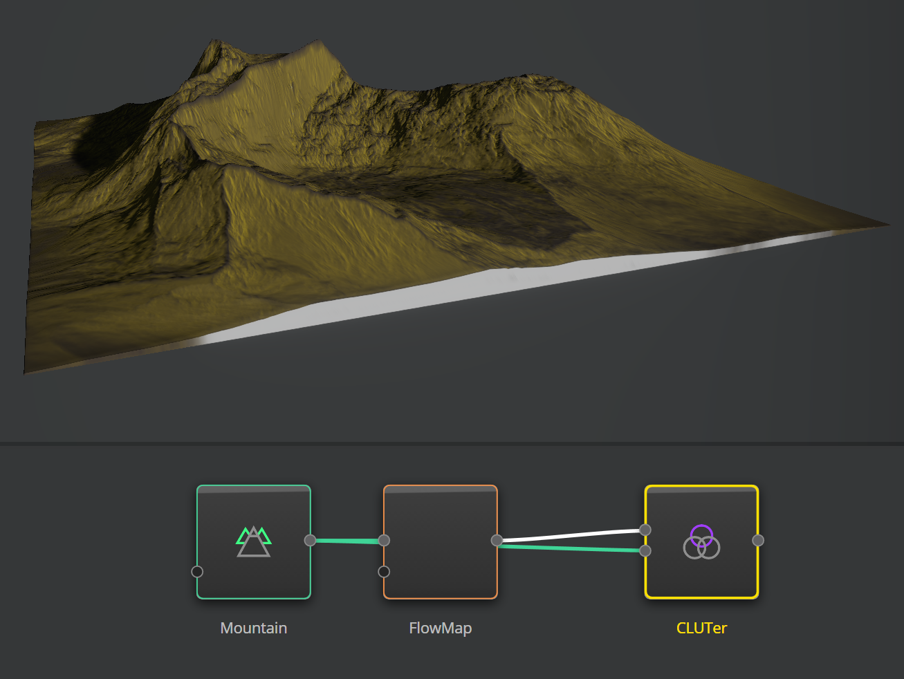

Coloration in Gaea is based on CLUTs, or color lookup tables. As 2D heightfields are essentially a grid of numbers ranging from 0.0 (lowest) to 1.0 (highest), CLUTs are represented as gradients which are mapped to those heights.

The lowest part of a gradient corresponds to the lowest part of the terrain. The highest part of a gradient corresponds to the highest part of the terrain. Everything in between is evenly distributed.

The CLUTer nodes let you take any grayscale input (such as @Curvature, @Slope, @Surface, @flow) and map it onto a gradient.

### Gradient Editor
Click anywhere in the gradient to create a new stop. Drag the stop to position it. Select the stop and press `DEL` to delete the stop.

# [Pre-Process](#tab/tabid-a)
| Setting              | Values      | Description                                                  |
| :------------------- | :---------- | :----------------------------------------------------------- |
| **Input Noise**      | 0 - 100% | Introduces noise to the incoming grayscale map.              |
| **Input Clarity**    | On / Off    | Applies localized contrast enhancements to the incoming map. |
| **Input Auto Level** | On / Off    | Applies an autolevels filter to the incoming map.            |
| **Reverse**          | On / Off    | Reverses the mapping of the gradient.                        |

# [Post-Process](#tab/tabid-b)
| Setting               | Values      | Description                                                    |
| :-------------------- | :---------- | :------------------------------------------------------------- |
| **Color Noise**       | 0 - 100% | Introduces minor color distortions to the map.                 |
| **Output Clarity**    | On / Off    | Applies localized contrast enhancements to the output texture. |
| **Output Auto Level** | On / Off    | Applies an autolevels filter to the output texture.            |
| **Data**              | Filename    | TODO                                                    |
| **Magick**            | Filename    | TODO                                                    |

> [!TIP]
> You can use **Input Clarity** instead of interjecting an Autolevels node to the graph.

In this example, a @flow is mapped by @CLUTer to create basic texture map.

For general information on creating color textures, see @Color-Production.

***

<!--examples-->